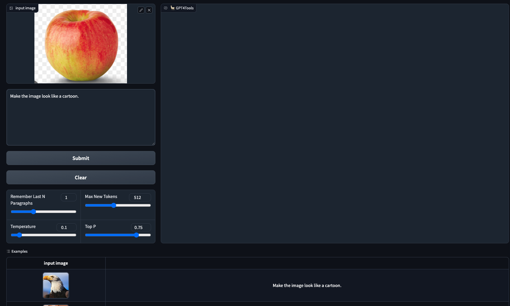

# COMP7404 - Group Project （GroupB）

## Topic: GPT4Tools

Here is our github repo: https://github.com/kenchudigital/COMP7404-GPT4Tool

Our team has selected `GPT4Tools` as the focus of our presentation.

Research Paper: [GPT4Tools Research Paper](https://papers.nips.cc/paper_files/paper/2023/file/e393677793767624f2821cec8bdd02f1-Paper-Conference.pdf)

## Demo

For our presentation, we will primarily focus on demonstrating the capabilities of GPT4Tools, aiming to make it engaging for the audience.

We plan to showcase the capabilities through a graphical user interface (GUI), as depicted below:



If time permits, we will also compare the performance of different models.

---

## What we have done?

We attempted to deploy the GUI using an M1 computer, but encountered numerous bugs and issues that need to be addressed. One major challenge we faced was the lack of memory and hard disk storage.

As a workaround for our demo, we utilized the 7b model instead of 13b model and, also we adjusted the parameters of the model like top_k, data type (float32 to float16), less tools etc to reduce the memory usage in this model.

However, if we use `cpu` in Mac, the memory usage is over 16GB when running this code and the amount of models is over 30GB. If we use 7b model, the hard disk usage will be more than 50GB.

- I also created `gpt4tools_demo_once.py` for once-time response. Or you can consider it as a test case.

---

## Additional Demo

We also can demostrate the prompt of the dataset in new approach and the evaluation of this new approach in `/GPT4Tools/sample.ipynb`


---

## File Structure

- `GPT4Tools` (includes the demo code)
- `Makefile` (commands to build the GUI)
- `result-chart` (for creating charts to compare different model performances)

`GPT4Tools/scripts/model/` - will install 7B and 13B model in there according to the code by `GPT4Tools/scripts/download.py` 

---

## Reference

The code in `/GPT4Tools` is essentially a clone from [GPT4Tools GitHub Repository](https://github.com/AILab-CVC/GPT4Tools).


```
Yang, R., Song, L., Li, Y., Zhao, S., Ge, Y., Li, X., & Shan, Y. (2023). GPT4Tools: Teaching LLM to Use Tools via Self-instruction. arXiv preprint arXiv:2305.18752.
```
